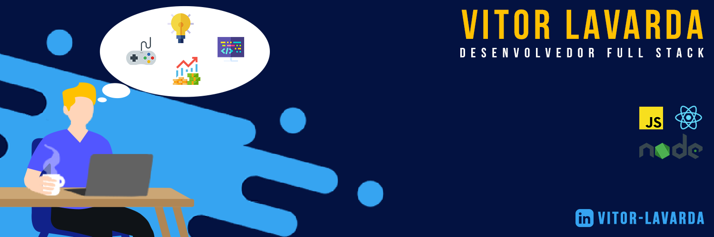

<table>
    <tr>
        <td></td>
        <td></td>
    </tr>   
</table>

 

### Welcome to my profile ! 👋

I have started programming with languages such as C++/C and Java and I became interested in software security engineer area after working with Pen-testing and Defensive security. At the moment I am a Computer Science undergraduate and working as a developer. 
 

## My main technologies are:

## I´m learning:

## My Social:

 

